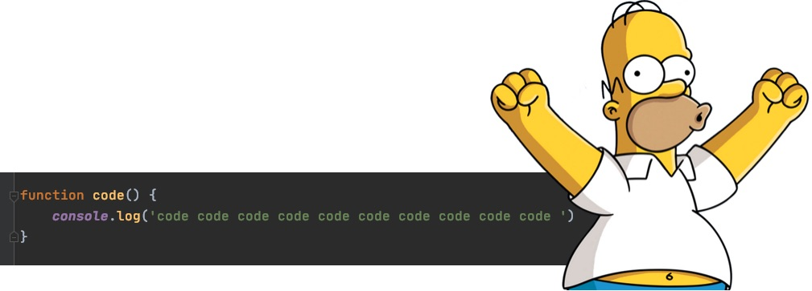

# Hello, folks! 

My name is Greg Sieranski and I'm a software developer. I'm currently working @Condenast. You can find me on [![Twitter][1.2]][1] or [![LinkedIn][3.2]][3].

## 🔧 Technologies & Tools

## &#x1f4c8; GitHub Stats

<!-- links to social media icons -->

<!-- icons with padding -->

[1.1]: https://i.imgur.com/tXSoThF.png (twitter icon with padding)
[2.1]: https://i.imgur.com/0o48UoR.png (github icon with padding)

<!-- icons without padding -->

[1.2]: https://i.imgur.com/wWzX9uB.png (twitter icon without padding)
[2.2]: https://i.imgur.com/9I6NRUm.png (github icon without padding)
[3.2]: linkedin-3-16.png

<!-- links to your social media accounts -->

[1]: https://twitter.com/wonbyte
[2]: https://github.com/wonbyte
[3]: https://www.linkedin.com/in/gsieranski/
